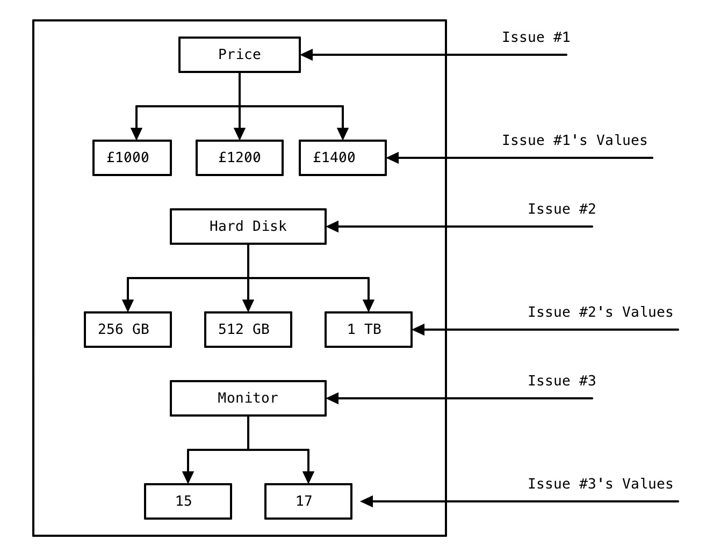

这一章节，我会带大家过一下Lab1和Lab2涉及到的基础知识点与概念。这些重要的概念对你以后如何编写自己的Agent极为重要。如果不能理解这些概念，会对你之后使用Genius的API造成很大的困扰。不过放心，我会用较为精简的话语带你们慢慢认识这些概念。当然，如果有说错的地方，也欢迎你们fork我的docs，帮我修改，然后push哈。

# 1.1 Domain, Issues 和 Values
Lab1中用了一个这样的场景来描述Domain(域), Issues(可以翻译为议题)和Values(值)之间的关系:

Agent A作为买家(buyer)要和卖家Agent B(seller)进行笔记本价格上的谈判(Negotiation)。

笔记本的属性包括价格(Price💰),硬盘大小(Hard Disk💿)以及显示器(Monitor🖥)的大小。(如下图所示)

那么:

Domain可以被理解为一个问题的场景(比如笔记本谈判这个场景，或者你也可以当成是一个剧本杀的剧本📚)，这个场景下有很多Issues需要Agent之间进行议论(比如议论价格多少，硬盘多大，显示器多大)，每个Issue具体取多少值，那就是Value啦。

用这样的角度去理解Lab1里的那些公式，应该会简单一点😊。

# 1.2 Preference Profiles and Utilities

## Preference Profiles
A 和 B 在笔记本交易这个Domain下，对Price, Hard Disk以及Monitor进行博弈。可以想象你眼前A和B轮流说出自己的报价(Offer)，比如：

A说我报一个offer{Price:£1200, HardDisk:1 TB, Moniotor:17寸}，你就说你卖不卖吧。

B说我不卖，我报一个offer{Price:£1500, HardDisk: 256 GB, Monitor:15寸}，你就说你买不买吧。

A说我不卖，我报一个......

就这样, A和B完成了一个round的博弈。很显然，他们是没达成协议的。因为他们各自的偏好(Preference)并没有被满足，所以他们并没有接受当前的offer。

说到这，你们应该明白了，每个Agent其实都有自己的Preference,这就像他们存在的目的一样，努力去完成这个目的，或者努力代理(agent的英文翻译为代理的意思)别人完成别人的目的，就像一个木有感情的工具人🤖。作为buyer，我当然希望price越低越好，hard disk越大越好，monitor越大越好。但作为seller，我当然是想price卖的越贵越好，hard disk越小越好，monitor越小越好咯。

那么如何去衡量一个offer对Agent个体之间的好坏？这个可以用数值去衡量吗？这就要引出一个新的概念叫做utility(效用)。

## Utility
Utility这个词，可能对大部分学生来说都比较陌生，少部分有过经济学或者金融学背景的童鞋应该能理解这个词的意思(下学期选修Computational Finance的同学需要多留意这些经济学概念噢🏦)。可以笼统的理解为你对这个东西有多喜爱，有多满意，就有多少效用。

怎么计算效用呢？当然有专门的函数来计算utility了。在学习这个function之前，实验中专门提到你们所要考虑的问题是Additive Utility Function下的问题。可以理解为所有的值都是离散的，比如，价格只有£10，£20，£30这些离散的情况。Genius下的条件都是离散的，而非连续的。

Additive Utility Function的公式是:

$$U_{j}(o)=\sum_{i=1}^{n} w_{j}^{i} \frac{\operatorname{eval}_{j}\left(o_{i}\right)}{\max \left(e v a l_{j}\left(I_{i}\right)\right)}$$

