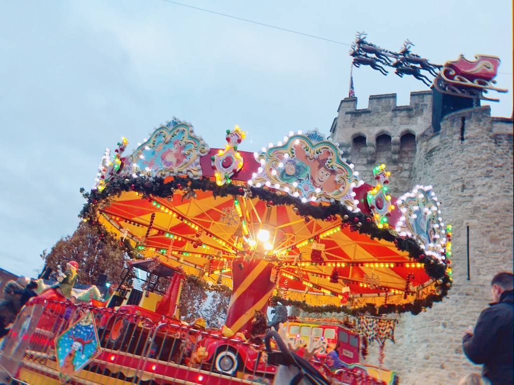

# Monologue
没有想到我还有一章吧。这一章就是让我随便说说好了。没有太多有建议的内容。但是如果你正处在焦虑之中，不妨可以看看这些内容，算是换一种心情。🌚知心老哥在线中。

## 别被吓到
写这个doc的初衷，可能源于一时心血来潮。🌛但更多的时候是我很理解你们，所以才想写这份docs。我并不是个大佬，所以当时面对这份作业的时候，心态其实是炸的。而且随着Agent的课的深入，我的心态炸的死死的。

以至于后来，我agent就开始翘课了，就一直在图书馆里写Agent大作业。那个时候的我还是比较无助的。就是通过读往年Agent的源码，一点点的理解，一点点的写，一点点的实现。有时候生怕自己的是抄袭别人的代码，所以每看一下别人的代码，都会自己重新写一遍优化代码，因为优化过后的代码是带有自己的想法的，所以就不构成抄袭了(抄袭很严重，待会会跟你们细细的说)。说实话，我这种人，是不可能无中生有的写出一段🐂🍺轰轰的代码，即便是大佬，也不可能凭空创造出来的。所以阅读学习别人的代码很重要。🌜

所以不要害怕我写的很多内容。因为我已经踩过了很多的坑，并且把一些idea写在了这份docs里。甚至有不少学弟学妹已经实现了我说的内容。你们已经比我当时的进度，甚至比我当时身边很多人的进度快很多了！

去年的这个时候，我才开始翘课呢，别说写出一个Agent了。😪

所以不要慌。你们的时间还是宝贵的。你们可以把多余的时间好好花在Foundation of ML上。那个比较有趣重要。

## 希望你们创新
我是不希望你们全部交遗传算法上去的。老师肯定一看都是抄的。别到最后有的人连Fitness都不改就直接交上去。这个绝对是抄袭无误了。抄袭发生，你这部分的分数都没了。严重点的连毕业可能都成问题。😓

当然我是相信花精力看这份doc的童鞋本身主动性就很强。我希望你们去花时间去实现一些与遗传算法类似的算法：
- 模拟退火算法 🔥
- 粒子群算法 🌰
- 蚁群算法 🐜
- 免疫优化算法 🦄
- 鱼群算法 🐟

或者机器学习算法：
- 梯度下降 🍇
- 贝叶斯优化 🐚

这些算法其实我也没自己实现过。但是你们认真实现完遗传算法之后，不仅学会了这套算法，也可以更容易的将其应用在其他类似算法。

同时，如果你们真的实现了以上的算法，非常欢迎你们将其分享在我的doc里面哈！

## 后续
后续我会尽力让一些学长把自己的agent分享到这个doc里。供之后的同学们一起学习，分享经验。后续估计也会把doc里的错别字找出来修改🌝尴尬。现在还是太懒了。

## 私货
我把我这一年的一些学习生活体验写在了知乎里。你们也可以看看哈。

[在南安普顿大学 (University of Southampton) ECS学院就读是什么体验？](https://zhuanlan.zhihu.com/p/109375478)

[在南安普顿大学 (University of Southampton) ECS学院是什么体验？（2）](https://zhuanlan.zhihu.com/p/144367598)

很高兴你能读完这个doc。也希望认识更多的学弟学妹们，跟你们一起进步，走在商业互吹的道路上一去不复返。

多认识一个朋友，以后在互联网圈子里跳槽的机会是不是更多了，你说是不是呢？🌝

