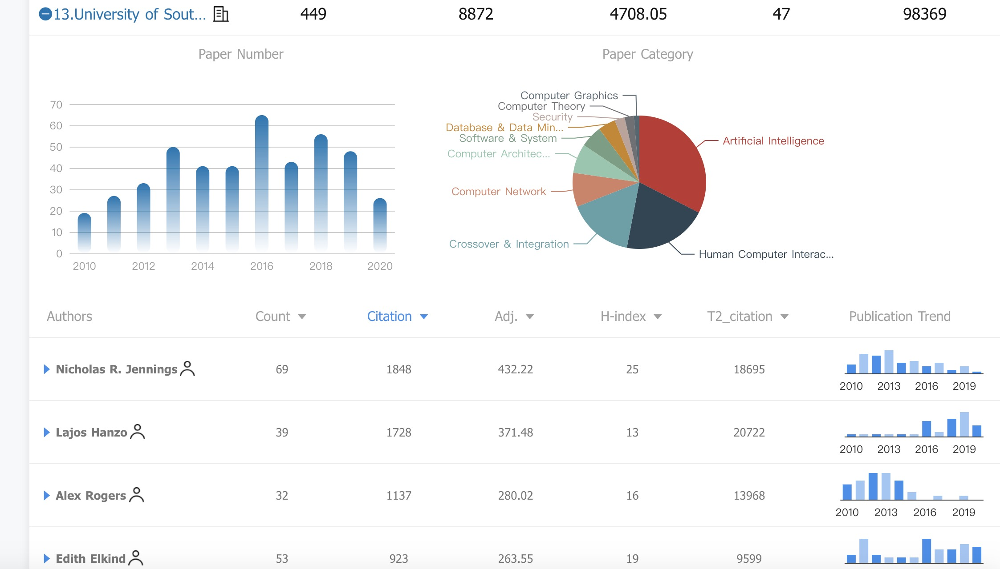
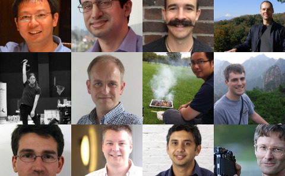
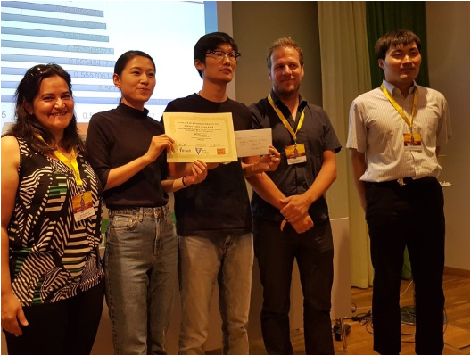
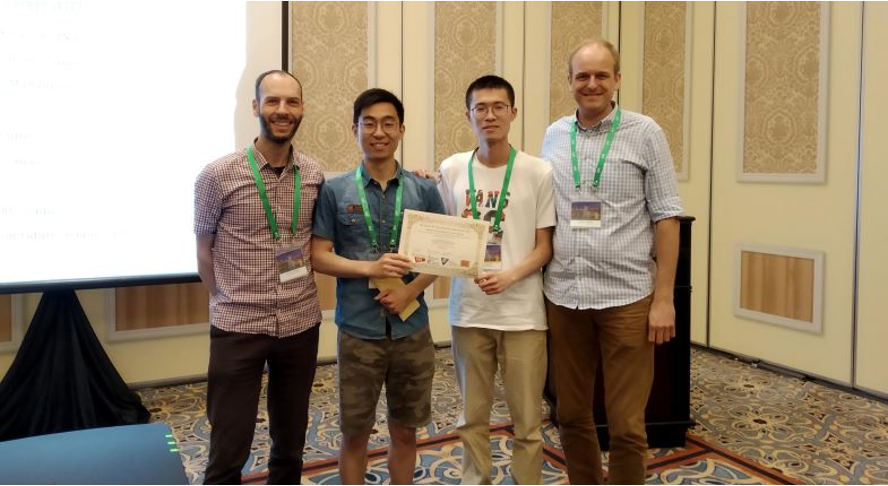

# Welcome to Intelligent Agent world
Hello, Southampton大学的AI同学你们好哈😊。你们都要学习Intelligent Agent这门必修课的(🤦‍♂️可能有些cs系的学生也选了这门课哈，希望你们能退则退吧)。这门课，无论是Coursework还是Exam，应该都是AI系第一学期最难的，没有之一🤣。但是，请你们不要畏惧大作业，因为大作业真的是如果你懂了，那么就很容易拿一个体面的分数，如果你踩了坑，那么分数会低的可怕。其实根据我和我上届学长的交流中可以发现，这门课的大作业虽然是四人组队，但大部分组都是一个人完成大部分的，一方面是内容确实难，另外一方面是确实很多人不会Java。我当时做的时候也是不断踩坑，希望得到更多的帮助。

那么，这也是我写这个docs的目的，我想让更多学生能够接触这门课程，而不是全程划水，竞赛看命。想要把前任学长学姐的经验传给下一代，把积累的经验一代代传下去。

总的来说，这个文档会教会你什么？（以下内容只是一个草稿哈）

* 了解COMP6203 Coursework到底是在干什么
* 理解Genius Core这个平台是如何使用的
* 如何写一个自己的Agent
* 预测自己模型，预测对手模型，出价策略的算法案例
* 如何在Report中拿到高分

以上的内容，都是基于我自己的经历写的。同时，我也会邀请到18届的学长，参与并撰写整个docs👊。

## Introduction
南安普顿大学的AI系下的 Multigent System方向，实力非常🐂🍺。虽然这个方向不是现在主流的AI落地方向，但是在学术界Agent领域，你说你是南安普顿的，大家肯定都知道。接下来我会介绍一下咱南安的Agent有多厉害。想要以此激发你们学习的兴趣呀。🙌🏻

### Agent比重
南安ECS在计算机方面的比重可以通过下面这张图看的出来(这里推荐一个比csranking还好的EE,CS排名网站,[ACEMAP](https://www.acemap.info/ranking))。可以发现，南安最近几年计算机发文的比重集中在AI和HCI，其中AI的大部分比重都是Agent。你会发现，虽然每年南安中的ICLR, ACL, NIPS, CVPR等火热的AI会议论文比较少(你们的CV, DL老师，Jon这几年产出ICLR和NIPS还算可以噢)，但像AAMAS(International Conference on Autonomous Agents and Multiagent Systems)这种CCF B类期刊基本上不会缺席哈。说到这，估计你们也能理解为什么IA这门课是必修课了吧。

    
     
    
AceRank上，南安排名前几的教授大部分都是搞Agent的 

### 关于AIC
提到南安的Agent，不得不说起 Agents, Interaction and Complexity group (简称AIC)。AIC是由 [Professor Tim Norman](https://www.ecs.soton.ac.uk/people/tjn1f15#_ga=2.258324554.13544906.1602674669-357846429.1552973807)领导的专门搞Agent相关研究的机构💻。

下图中的一些老师，我也认识一些，给你们稍微简单介绍一下哈。

[0,0]位置是[Jie Zhang](https://www.ecs.soton.ac.uk/people/jz5c16#_ga=2.31864318.13544906.1602674669-357846429.1552973807),很厉害的中国老师(好像是清华毕业🙄)，现在好像主要搞区块链，如果你们选计算金融的话，他可能会是授课老师。他最近几年产出了两篇AAAI,一篇IJCAI，还有一个MFCS。这个产出还是挺好的。毕竟咱也不能跟国内大实验室比产出哈。

[0,3]那个老师是[Enrico Gerding](http://www.southampton.ac.uk/~eg/#_ga=2.127909581.13544906.1602674669-357846429.1552973807)，是你们Intelligent Agent的老师。也是我的毕设导师，人非常nice。Agent领域算是比较厉害的哈。产出也还行，最近几年，3篇AAMAS，1篇JAIR，其他的论文可能不是AI领域的，我也不认识，反正我看他挺喜欢搞金融的。19届有个你们的学长，读Norman底下的博士，二导就是他，如果有机会，也可以带你们认识一下你们的学长。

[1,1] 是大老板[Tim Norman](https://www.ecs.soton.ac.uk/people/tjn1f15#_ga=2.258324554.13544906.1602674669-357846429.1552973807), 他也有可能参与到这门课的教学当中来，比如上学期，他就叫我们去中心化的内容。

[2,2] 是[Richard Watson](https://cmg.soton.ac.uk/people/raw1/),是你们Foundation of AI 的老师。看样貌平平无奇，上课的内容看似索然无味，没有用处。但是他给分松，而且考试难度低。是真的好哈。他的研究方向还是比较偏进化算法相关的。

[2,3] 是另外一个大佬，[Professor Gopal Ramchurn](https://www.ecs.soton.ac.uk/people/sdr1#publications)。最近三年，4篇AAMAS, 1篇AAAI, 2篇IJCAI, 2篇CHI (CCF 人机交互A类), 1篇SIGKDD, 1篇AI, 1篇PR... 哎，有钱真的可以为所欲为的招博士打工😱。

    
     
    
AIC主要大佬们。

###学生荣耀
每一届，Enrico都会推荐学生踊跃报名参加ANAC比赛，就是专门搞Agent竞赛的比赛。一般挂靠在IJCAI这个顶会下面举办的。也就是说，如果你的Agent获奖了，你可以去参加IJCAI唉，而且还是学校报销机票。南安已经有两届拿奖了。

    
     
    
2018年 ANAC in Stockholm 第二名 

下图中，左边的学长是Shaobo Xu (现在在华为工作)，右边的学长是[Peihao Ren](https://github.com/renph) (现在在英国工作)。听Ren说在澳门参加IJCAI见到很多大佬，其中还包括周志华唉，他们还找周志华签名西瓜书呢🥳！

    
     
    
2019年 ANAC in Macau 第一名 

可惜受疫情影响，原本2020 ANAC是在日本京都举办的，也被取消了。并且，举办方已经将我们使用的Genius Core这个客户端版本，换成了GeniusWeb版本。两个版本代码不兼容的，所以很难实现。我问了Enrico今年上课会用哪个版本，他说还是会用旧的客户端，因为功能比较完善。

## About us
Aloha,😊。该学习指南的作者现在只有两个人哈。也欢迎那些愿意将自己当初做的agent的经历经验分享给下一届的同学们哈。如果你对这份学习指南比较满意，希望可以star或者follow我们。这会是我们继续完善这份指南的动力。当然，也很乐意通过这样的方式认识大家。毕竟互联网圈人脉广阔，以后跳槽也方便哈。

  
    

 <h3 style="font-family: 'Apple Braille'">Robin Luo</h3>
 
 
2019 AI master at the Uni of Southampton
 

 
 

  
   
 

  
    

 <h3 style="font-family: 'Apple Braille'">Peihao</h3>
 
 
2018 AI master at the Uni of Southampton
 

 
 

  
   
 

