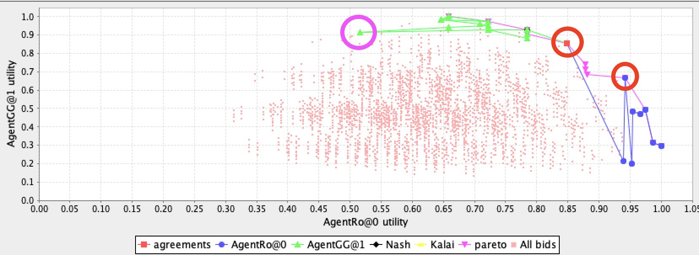

# 知彼
在这一节内容里，终于迎来了最令人激动的环节：预测对手模型(predict the opponent model)🥳。你不仅会学到衡量一个offer的质量的评价标准(Quality Metrics)🙄，更能学到干货： Johny Black， 这个在Lab3中提到的预测对手模型的方法的实现细节😛，这肯定会帮助你少走弯路，并且节省很多时间😇。

注意🐞：这一节也是大部分同学与这门课大作业脱钩的地方。因为涉及到自己实现预测对手模型，没有Java基础的童鞋很容易在Hashmap和面向对象编程这里畏缩，放弃，然后扔给一个同学来写。如果你们确实遇到这样的问题，可以参考我的实现方法。虽然我Java代码写的一般般。但是它是能跑的起来的噢。如果你能认真读一遍，理解一遍，我觉得你的收获会非常的大，你甚至可以理解到面向对象的妙处😎，这对你以后找工作也好，刷题也好，都能起到帮助。

## Quality Metrics
首先需要知道的是，我们有很多手段去测量自己的agent表现的好不好👍。这其中包括四种，个体效用(Individual Utility),社会福利(Social Welfare),距离帕累托效用边界的距离(Distance to Pareto Efficient Frontier)和距离纳什均衡点的距离(Distance to Nash Point)。👾下面我会用比较简单的表达来告诉你这些词的意义，以及会怎么用。具体的数学公式还是需要你们自己去看Lab3的内容(虽然部分的内容，考试不会考，agent设计也用不到🤡)。

### Individual Utility
Individual Utility, 我在之前提到过，每一个offer对不同的agent会有不同的utility。实际上这也是用的最多的metrics方法来评估你的agent的表现。比方说，你的agent能够准确的计算出当前offer给自己和给对方带来多少utility，这叫知己知彼，才能百战不殆👨‍💻

### Social Welfare
Social Welfare，社会福利。如果你的agent能使双方的utility之和最大，那也是非常好的agent。ANAC比赛中有个评价标准就是social welfare。这个比较容易理解👨‍🏫

### Distance to Pareto Efficient Frontier
Pareto Efficient Frontier，帕累托效用边界。在之前讲basic concept的时候，推荐你们去知乎读这个 [如何通俗地解释「帕累托最优」（Pareto optimum）？](https://www.zhihu.com/question/22570835/answer/21816685)🧠。

如果说让我一句话举例什么叫帕累托最优，那就是:假设能让我获得效用为0.8的offer有3个：

- offer1: 我得0.8，你得0.6。
- offer2: 我得0.8，你得0.5。
- offer3: 我得0.8，你得0.4。

那么offer1就是帕累托最优的offer。因为我已经没办法在不损失自己效用的情况下，提升你的效用💁‍♂️。

如果说让我一句话概括什么叫帕累托最优: 这个是我能给你的最好的报价了。如果你想比这个更好，那我自己就得亏了（比如我得0.7,你得0.7，这种情况，我是亏了0.1🙅‍♂️）。

干货：帕累托效用边界，考试可能会考。下学期选计算金融的，需要对这个概念有印象。然后在agent大作业的时候，主要是chooseAction中报价策略中，你要考虑尽可能自己的offer是当前能给对手最高utility的offer（注意🐞，因为你的算法会存在误差，建议报offer的时候，可以设定一个阈值，出一个offer是能给对手最高utility的95%或者90%）。这样你的offer就容易贴着帕累托效用边界🦄。

为了加深大家对Pareto Optimum的理解，以及在Genius中的运用。我继续用我的agent和agentGG博弈的结果给大家举例。从下图可以看出，红色的两个圈内的offer都是在Pareto Efficient Frontier上的，我的报价都是在保证我自己的utility的前提下，给了agentGG最高的utility。粉圈内的offer，就不是一个帕累托最优的offer，因为在它的右边，还有那么多能给我带来高utility的offer，agentGG偏偏选了一个给我低utility的offer，说明它不是很厚道🐣(当然，这跟他基于频数的计算有关，甚至我的几次出价也没有给它带来最高utility,因为我的预测对手算法--Johny Black，也是基于频数的。基于频数的算法有个特点，就是刚开始不准，但是到后来会越来越准。我在后面会和大家细讲这个Johny Black。)

### Distance to Nash Point
这个知识点没啥好说的。看公式意会一下就好。当然，要注意的是，纳什点与你们在学囚徒困境的时候学的纳什均衡不是同一个概念。

你可能会问，为什么我回答这小节这么随意呢😓一方面 $argmax$ 这种情况很难计算。另外一方面，$U_{i}\left(o_{\text {disagr}}\right)$,你要考虑未达成一致的协议的情况，导致很难取求纳什点。至少我没有计算很准确的纳什点。为什么这个这么重要😣因为我们那一届，如果你和对手达成一致的offer距离Nash point很近的话，是可以当做bonus，分数会高很多的。

有些人的Agent很头铁，非要给自己utility 0.9, 给对手0.3。虽然你的individual utility高，但是你的nash point这一项分数低的吓人(这也是为什么会出现负分的情况)。

我觉得如果说看完我这套docs,你能学到一个比较好的预测对手模型算法和一个比较好的预测自己模型的算法，但是想要得到突破，那就要在这个地方有所突破(前提是今年的bonus还是Nash point)，因为我这个得分点做的不是很好🥬。