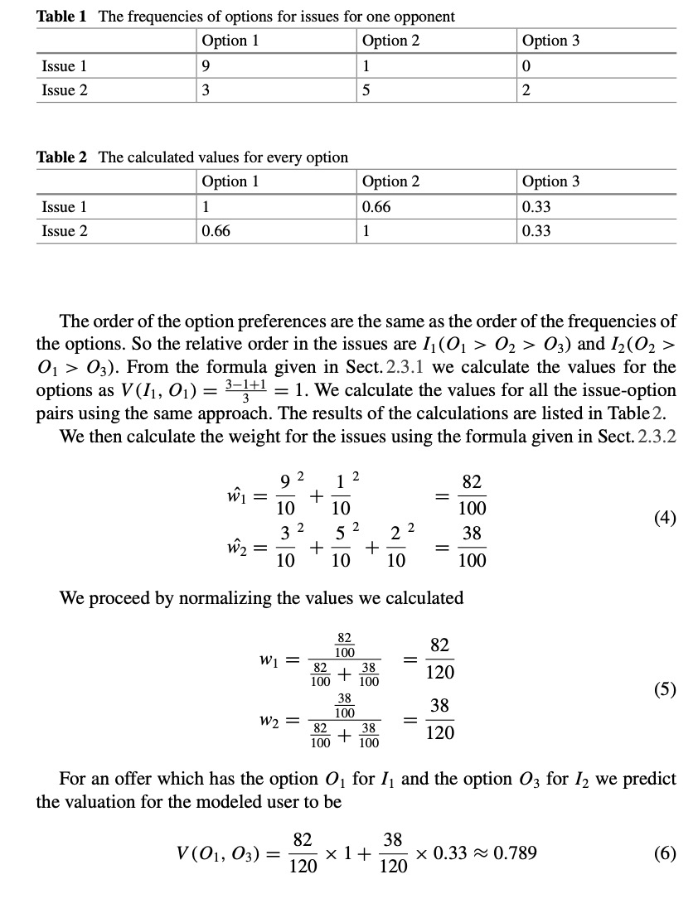

# 知彼
在这一节内容里，终于迎来了最令人激动的环节：预测对手模型(predict the opponent model)🥳。你不仅会学到衡量一个offer的质量的评价标准(Quality Metrics)🙄，更能学到干货： Johny Black， 这个在Lab3中提到的预测对手模型的方法的实现细节😛，这肯定会帮助你少走弯路，并且节省很多时间😇。

注意🐞：这一节也是大部分同学与这门课大作业脱钩的地方。因为涉及到自己实现预测对手模型，没有Java基础的童鞋很容易在Hashmap和面向对象编程这里畏缩，放弃，然后扔给一个同学来写。如果你们确实遇到这样的问题，可以参考我的实现方法。虽然我Java代码写的一般般。但是它是能跑的起来的噢。如果你能认真读一遍，理解一遍，我觉得你的收获会非常的大，你甚至可以理解到面向对象的妙处😎，这对你以后找工作也好，刷题也好，都能起到帮助。

## Quality Metrics
首先需要知道的是，我们有很多手段去测量自己的agent表现的好不好👍。这其中包括四种，个体效用(Individual Utility),社会福利(Social Welfare),距离帕累托效用边界的距离(Distance to Pareto Efficient Frontier)和距离纳什均衡点的距离(Distance to Nash Point)。👾下面我会用比较简单的表达来告诉你这些词的意义，以及会怎么用。具体的数学公式还是需要你们自己去看Lab3的内容(虽然部分的内容，考试不会考，agent设计也用不到🤡)。

### Individual Utility
Individual Utility, 我在之前提到过，每一个offer对不同的agent会有不同的utility。实际上这也是用的最多的metrics方法来评估你的agent的表现。比方说，你的agent能够准确的计算出当前offer给自己和给对方带来多少utility，这叫知己知彼，才能百战不殆👨‍💻

### Social Welfare
Social Welfare，社会福利。如果你的agent能使双方的utility之和最大，那也是非常好的agent。ANAC比赛中有个评价标准就是social welfare。这个比较容易理解👨‍🏫

### Distance to Pareto Efficient Frontier
Pareto Efficient Frontier，帕累托效用边界。在之前讲basic concept的时候，推荐你们去知乎读这个 [如何通俗地解释「帕累托最优」（Pareto optimum）？](https://www.zhihu.com/question/22570835/answer/21816685)🧠。

如果说让我一句话举例什么叫帕累托最优，那就是:假设能让我获得效用为0.8的offer有3个：

- offer1: 我得0.8，你得0.6。
- offer2: 我得0.8，你得0.5。
- offer3: 我得0.8，你得0.4。

那么offer1就是帕累托最优的offer。因为我已经没办法在不损失自己效用的情况下，提升你的效用💁‍♂️。

如果说让我一句话概括什么叫帕累托最优: 这个是我能给你的最好的报价了。如果你想比这个更好，那我自己就得亏了（比如我得0.7,你得0.7，这种情况，我是亏了0.1🙅‍♂️）。

干货：帕累托效用边界，考试可能会考。下学期选计算金融的，需要对这个概念有印象。然后在agent大作业的时候，主要是chooseAction中报价策略中，你要考虑尽可能自己的offer是当前能给对手最高utility的offer（注意🐞，因为你的算法会存在误差，建议报offer的时候，可以设定一个阈值，出一个offer是能给对手最高utility的95%或者90%）。这样你的offer就容易贴着帕累托效用边界🦄。

为了加深大家对Pareto Optimum的理解，以及在Genius中的运用。我继续用我的agent和agentGG博弈的结果给大家举例。从下图可以看出，红色的两个圈内的offer都是在Pareto Efficient Frontier上的，我的报价都是在保证我自己的utility的前提下，给了agentGG最高的utility。粉圈内的offer，就不是一个帕累托最优的offer，因为在它的右边，还有那么多能给我带来高utility的offer，agentGG偏偏选了一个给我低utility的offer，说明它不是很厚道🐣(当然，这跟他基于频数的计算有关，甚至我的几次出价也没有给它带来最高utility,因为我的预测对手算法--Johny Black，也是基于频数的。基于频数的算法有个特点，就是刚开始不准，但是到后来会越来越准。我在后面会和大家细讲这个Johny Black。)


### Distance to Nash Point
这个知识点没啥好说的。看公式意会一下就好。当然，要注意的是，纳什点与你们在学囚徒困境的时候学的纳什均衡不是同一个概念。

你可能会问，为什么我回答这小节这么随意呢😓一方面 $argmax$ 这种情况很难计算。另外一方面，$U_{i}\left(o_{\text {disagr}}\right)$,你要考虑未达成一致的协议的情况，导致很难取求纳什点。至少我没有计算很准确的纳什点。为什么这个这么重要😣因为我们那一届，如果你和对手达成一致的offer距离Nash point很近的话，是可以当做bonus，分数会高很多的。

有些人的Agent很头铁，非要给自己utility 0.9, 给对手0.3。虽然你的individual utility高，但是你的nash point这一项分数低的吓人(这也是为什么会出现负分的情况)。

我觉得如果说看完我这套docs,你能学到一个比较好的预测对手模型算法和一个比较好的预测自己模型的算法，但是想要得到突破，那就要在这个地方有所突破(前提是今年的bonus还是Nash point)，因为我这个得分点做的不是很好🥬。

## Johny Black

###理论
接下来我会带大家一起用Java复现Johny Black论文，当然，默认大家已经读过这篇论文了，没读的点击👆 [Johny Black](https://secure.ecs.soton.ac.uk/notes/comp6203/papers/JohnnyBlack.pdf),下载下来读一读哈。

当然，这篇论文也写了Accepting strategy (接受offer的策略) 和 Bidding strategy(出价策略)。你们也可以学习一下。但是他没有写预测自己模型的策略，因为那时候比赛还没有引入这个机制👀。

这篇论文其实还是比较容易理解的(比起Foundation of AI 让你读的那些五六十年代的长篇文章，这篇真的是良心，你能读得懂，并且你能容易复现🤣)，其实文章的开头部分你都可以略读，但是到了 2.3.3 Example Model这一节，你只需要把这个例子自己推一遍，如下图，就可以理解Johny Black的精髓: 通过频数去推断对手更想获得的option。




什么意思呢😇？打个比方，在issue这个下面有可乐，雪碧，芬达三个options。如果你更喜欢可乐，最不喜欢芬达。那么你的每一次offer，都会尽可能的去选可乐。可能你报的10个offer中，有7个选了可乐，2个选了雪碧，1个选了芬达。那么你的偏好就会被我知道啦！🤪

## Java代码实现
（注意🐞：切记直接抄代码，或者只是修改变量名，而非修改逻辑。IA这门课是会对过去的代码进行查重的噢。在英国，抄袭可是很严重的。）

在Java代码实现的过程中，我们需要明确一个概念，就是尽可能的利用Genius提供的类去写代码🤔。比方说，```import genius.core.issue.Value;``` Genius提供了Value这个类，那我们就得想尽办法在这个类的基础上去进行值的操作。这样，你在实现的过程中会简单许多🤫 ！

当然，我的java能力不是特别好。如果有java大哥能写出更优质的代码，欢迎issue🥬。

###定义一个新的类: ValueNew
首先，我定义了一个新的类，叫```ValueNew```。可以看到，我这个```ValueNew```里，存放了一个```Value```属性的值名字叫```valuename```。也就是说，我这个值通过调用valuename来实现Genius的中的```Value```类型的功能。

不仅如此，我还让我的ValueNew继承了 Comparator的接口。原先的```Value```类型是无法比较大小的。但是现在，我继承了```Comparator```接口，让其在```compare()```函数中定义了一个比较规则，规定，所有的```ValueNew```类型的值，根据其内部的count数来排大小🐷。 (Java萌新注意:这里一下子就提到了面向对象的两个特性:继承和多态。首先我们继承了```Comparator```这个接口。这个接口本身就是用来比较大小用的。其次我们也重写了```Comparator```中的```compare()```方法，可以理解为重新制定了一个比较方法。)

为什么要那么麻烦继承一个```Comparator```呢🧐？实际上，回顾Johny Black论文中，里面是不是有个要求，是根据options出现的频数来排顺序？我现在的功能就是完成排顺序这个环节。现在你可能还看不出来这用处，但是到后面你就会理解啦。


```java
import genius.core.issue.Value;
import java.util.Comparator;
   
   public class ValueNew implements Comparator<ValueNew> {
       public Value valueName;
       public int count=0;    //计数器，记录一共出现了多少次
       public int rank=0;     //根据options出现的次数，排一个rank，其中出现次数越多，rank越大
       public int totalOfOptions=0;  //记录当前options有多少个。也就是说一个value下有多少个options
       public int countBidNumber=0;  //记录对手一共出了多少次bid，也就是每个issue中的value总频数
       public double calculatedValue=0.0f; //论文上用来计算每个options的calculatedValue
       public double weightUnnormalized=0.0f; //在论文中是count/出现的总次数值
   
       public ValueNew(Value valueName) {
           this.valueName = valueName;
       }
   
       //我们需要根据count数目进行排序
       @Override
       public int compare(ValueNew o1, ValueNew o2) {
           if(o1.count < o2.count){
               return 1;
           }else{
               return -1;
           }
       }
       public void compute(){
           this.calculatedValue=((this.totalOfOptions-(double)this.rank+1)/this.totalOfOptions);
           double temp=((double) this.count/(double) this.countBidNumber);
           this.weightUnnormalized=Math.pow(temp,2);
       }
   }
```


