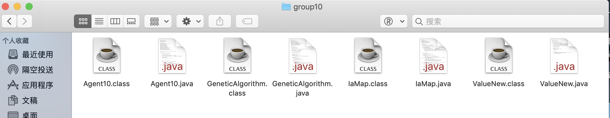
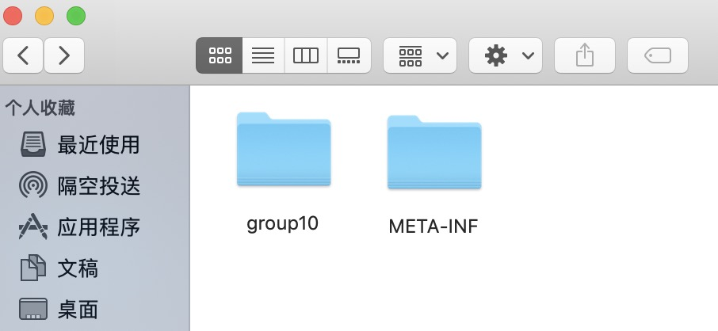
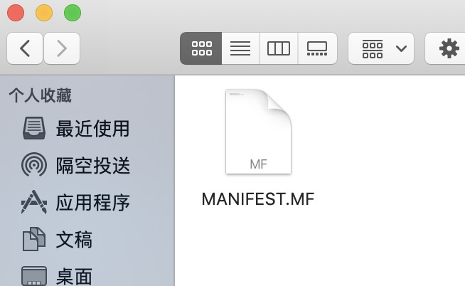
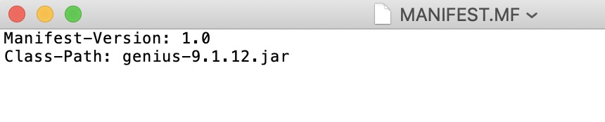
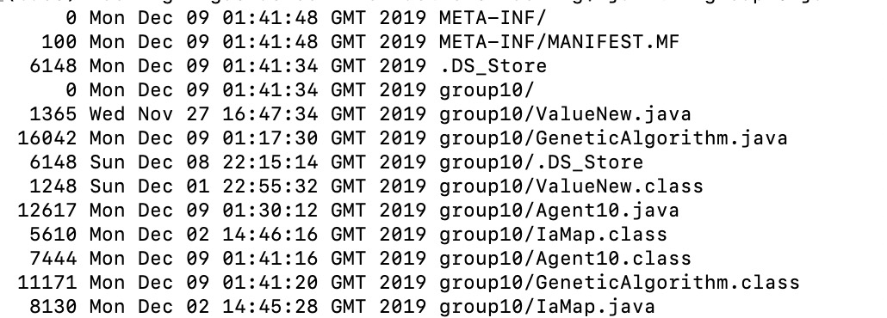

# 提交和报告


这一章其实就是该docs有关agent内容的末尾了。主要还是讲讲比较重要的report和一个不太重要的提交agent。

## 提交你的Agent
下面我会把我自己如何打包jar包的方式和大家讲一下。可能不同的人有不同的打包方式。这个我也是当时自己百度的，后来习惯用的。你们可以试试是否可以提交成功🦋因为今年的手册我没看，所以可能提交方式有所变化。如果无法提交，希望你能及时issue一下，后来我可以做出更改。

### 1. 将.java和.class文件放在同一目录
为了提交你的Agent到Mini Tournament服务器上，首先，你需要将所有的.java文件和.class文件放在一个目录下,如下图所示。🦍




### 2. 创建一个META-INF文件夹
以上的.java文件和.class文件都放在了group10(具体number根据你自己的group id来设置)的文件夹里。这个group10和一个叫META-INF的文件夹放在一起。如下图所示。🐢



### 3. 写一个MANIFEST.MF文件
META-INF文件夹里存放了一个MANIFEST.MF文件(自己创建一个txt文件然后改后缀名)。🦄



这个文件里写的内容是 ```Manifest-Version: 1.0```， ```Class-Path: genius-9.1.12.jar```。🐴



### 4. 生成jar包
然后回到group10和META-INF文件夹下，打开命令行，输入```jar cfm group10.jar META-INF/MANIFEST.MF ./```。🐗

### 5. 查看是否生成成功
命令输入之后，会在当前文件夹下生成一个group10.jar。最后，你可以通过输入```jar tvf group10.jar```，看看是不是jar包里包含了所需的内容。🐺




## 撰写Report
说到撰写report，很多人可能觉得report不是那么重要。但是如果你上过Computer Vision,上过Foundation of AI,report的比重可是比较高的(🤣Foundation of MLd的report比重也挺高，有接近40%，but你们可爱的尼软酱老师基本上是全给满分的！)。你的Agent做的再好，也撑死20分满分,但你的report也是20分。这么看来，是不是该重视起来了呢？👻

我自己的report拿的是75分。也算是有资格可以给你们一些建议(如果你们写Computer Vision 作业2的report,我感觉我能给你们更多的建议噢)🤒。

话不多说啦，我还是开始讲要点啦。

### 1. Report基础
首先，我是强烈建议用Latex的，而且强烈安利用[Overleaf](https://www.overleaf.com/)这个在线Latex编辑，因为你们自己装Latex会出现各种各样的问题，而且，Overleaf是云保存的，你不容易丢失数据。

如果你们选了Foundation of ML，尼软酱老师肯定是要求你们用Latex写的。如果没有选这门课的同学，我也是建议自己学Latex，不然的话，你以后那么多report，用Word写，又丑又累。尤其是最后写毕业论文的时候，学过Latex的同学基本上在论文排版方面比那些其他学院用Word写毕业论文的人舒服很多。因为用Latex的同学花在论文排版上的时间为0，但是用Word，那简直酸爽要命了🤭。

关于Latex模板，老师推荐的是IEEE的模板，但我个人比较喜欢用CVPR的模板，其实我问过Enrico，他说不在意我们用什么模板。总之，你不可能自己写一个模板出来，那样用Latex太费时间了。用别人已经做好的模板就好啦。在Overleaf中，你New Project的时候，里面有选模板，你可以View ALL搜索自己想用的模板哈。

关于语法。我强烈建议你们的Google 翻译安装一下[Grammarly](https://app.grammarly.com/)这个插件。你只要把你的英文句子复制进去，它能帮你查出纠正最基本的语法错误和拼写错误！记住，拼写错误很致命！如果你们以后选Jonathan的课(Computer vision, Deep learning)，他对拼写错误很重视😭！这个是不该丢分的地方哈。

### 2. Report结构

1. Abstract 摘要。这个肯定是要有的。但是内容也不需要复杂，你就说你在预测对手模型，预测自己模型，妥协策略上用的什么方法，最后取得了多少名的结果🌺

2. Prediction of the opponent model. 这个基本上就是写Johny Black吧。虽然大家多写了Johnly black,你可以说说你在这方面用的什么数据结构去实现的。这个过程中有没有遇到过什么问题？🌸

3. Prediction of the user model. 写预测自己模型的东西。我觉得我用的遗传算法能有很多内容可以讲，所以这一段基本上有料写的。比如我的Fitness函数是怎么取的。又比如我引入了精英选择策略。我甚至还把Error的变化曲线用Matplotlib画出来告诉老师我这个收敛的快。画图真的很重要哈，因为说实话，你写再多的技术，都不如几张图片来的美观简洁。再其次，你们也要培养自己的Critical thinking，比如我说我的Fitness函数这么取好，那为什么好呢？因为我比较过了，比较的同时我用图像直观的画出来了。又比如Johny black和 遗传算法，我用他们难道没有任何weakness吗？Johny black是基于频数的，所以会不会对手有可能知道这一点，故意用了一些策略，让我的Johny black算不准？🌚遗传算法很厉害吗？我不觉得厉害。为什么不厉害呢？因为它有缺点。什么缺点，因为它算的慢，而且变异率这个超参数很玄学，能不能跳出局值全看命。。。记住，有时候说出Disadvantages要比说出Advantages更能反映出你对知识点的理解。要敢于在文章中说一些反对的话，并且有理有据，我认为老师是会喜欢这样的report，至少我写了那么多的report，都是按照这个风格写的(Agent report是我这一年里写过的report中分数最低的。毕竟Enrico太严了😓)。这一段我写这么多，就是想让你们重视一下这一点，也是为了让你们能够获得更高的分数。基本上每个section，我都建议你分析一下优劣。🌼

4. Concession strategy。 这一段我没啥好说的，我这一部分本身做的就不好，也没什么内容可以写。🌻

5. Analysis of the result。你们最后的Agent是会经过南安的超算(Iris)计算，然后获得结果的。这个文件超级的大。因为你们的每个Agent都跟其他所有Agent在很多不同的Domain下比赛过。最后的Excel数据很多。但是你们只需要关注自己的比赛的那几段就好了。然后你们需要分析，通过结果分析，最后得出你们的Agent的缺点(比如太容易妥协了，negotiation成功率太高，但是分数不高。或者头太铁了，很多谈判没有达成)。光是分析缺点是不够的的，你们还要说出提升agent的表现性能的可能解决方案。同时，最好用一些方式(metrics)，比如柱状图，来衡量你的Agent的表现，🌹

6. Conclusion，这个是必须写的。虽然就是把你的整个框架和结果复述一遍。🍁

7. 写上你组员的各个分工。不是很重要，随便写写。🍀

8. Reference,写上几篇，一是装严谨，二是好看，逼格一下子提升上来了。🌿


## 总结
总而言之，report，我是觉得，如果你认真写还是可以写好的。虽然report是圣诞节后交，但是越早交心里越不慌啦。我是圣诞节前就写完啦。所以圣诞节后，看到其他队都在赶report的时候，我已经开始复习其他科目啦。🎄

当然，我当时也是慌的一P。所以，为了让自己的焦虑感减轻点，就在图书馆花几个小时写完啦。🌝


