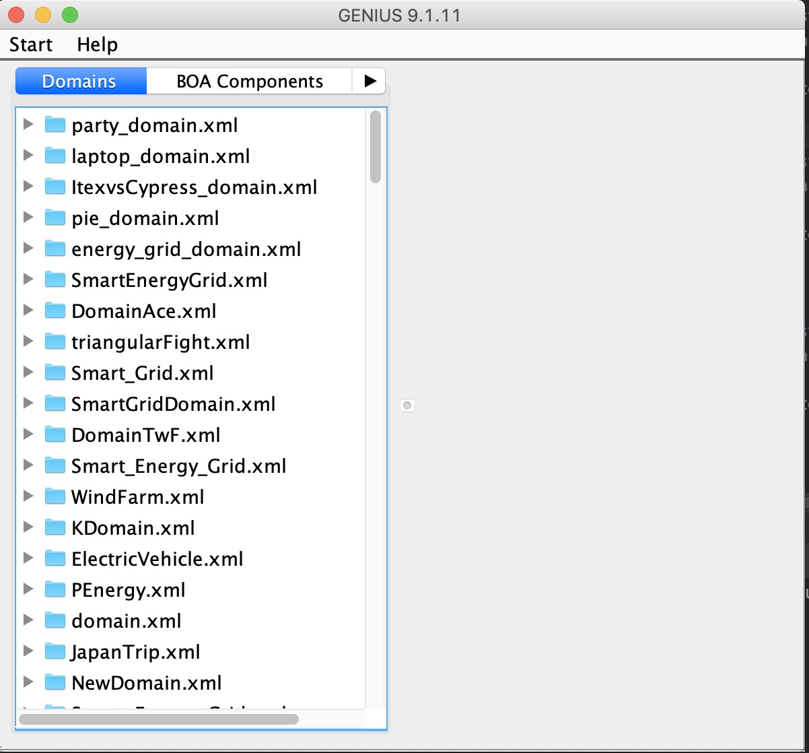

# 安装和配置Genius
默认你们很多人之前没有java基础，所以这里会写的比较详细一点。希望科班出身的童鞋能够照顾一下身边没有java基础的童鞋哈🧐。如果嫌文字比较长，你们可以看视频去完成，这个视频是你们🖥Lab2中会提到的视频，是一个提前录制好的 [视频链接](https://www.youtube.com/watch?v=ES_bpdRiSNM)。

另外，下面的内容可能与你们🖥Lab1 Task2: A first look at Genius 有重叠之处，如果你们的Genius环境已经配置好了，就可以跳过这一段啦。

## 配置Java环境
首先我们要安装配置Genius的开发环境，即JDK 8(Java Development Kit)，大家版本不要弄错啦。这里没有基础的童鞋们需要注意下JDK和JRE(Java Runtime Enviroment)的关系。JRE是一个运行环境，能让你跑JAVA程序，但是你不能开发它。但是JDK是一个工具包，你可以用这个工具包去开发JAVA程序。所以我们要安装的是JDK，并且你装了JDK就默认自带了JRE。

这里有一份比较全的[安装和配置Java环境的教程](https://www.runoob.com/java/java-environment-setup.html)，虽然是Windows版本的。Mac配置Java环境可以自己搜索哈。

## 下载Genius
注意🤒： 截止到目前，我看了一下你们Lab1的中下载Genius的内容，发现它还是让学生自行在代尔夫特理工大学的网站上下载最新版本的Genius。但是需要注意的是，TUDelft官网上的最新版本是Genius9.1.11。然而在后面的Lab4中，老师会让你们用最新版本，也就是Genius9.1.12。到那时候又要重新装一遍。而且，还得删掉旧版本，不然新版本会出不来，也会报错。所以我的建议是直接下载新版本9.1.12版本。

Genius9.1.12版本地址为：[Genius9.1.12](https://secure.ecs.soton.ac.uk/notes/comp6203/genius/genius-9.1.12.jar)。

## 运行Genius
双击jar包，就可以运行Genius啦(如果双击无法打开, Mac系统可能会出现这种情况，你可以打开终端，输入: java -jar genius-9.1.12.jar )。

至此，你已经可以运行Genius啦(虽然图上显示的是9.1.11版本，但是实际上是9.1.12版本)。

需要注意的是。此时你只是能运行Genius，可以用上面的Agent进行比赛。但是你无法去编辑或者说是生成一个具备自己设计策略的Agent。这时候你就需要在在编辑器上运行Genius啦。

## 使用IntellJ IDEA
虽然实验中说用Eclipse也是可以的，但是JetBrain全家桶还是香啊🤤。这里强力推荐用IDEA,而且还是付费版的IDEA，不需要破解，不需要破解，🤪。用你们的学校邮箱申请学生专用License, Pycharm, IDEA等Jetbrain全家桶可以用一年。

这里给一个申请License的链接。[JetBrain 教育](https://www.jetbrains.com/community/education/#students)。资本主义的羊毛，一定得薅一遍。诸如此类的羊毛。比如学校用你们学费买的各种软件都可以在 [https://software.soton.ac.uk/](https://software.soton.ac.uk/) 下载。

当下载好了IntellJ IDEA之后，跟着开头提到的视频 [视频链接](https://www.youtube.com/watch?v=ES_bpdRiSNM) 一步步的操作，这样你就会有一个ExampleAgent的示例啦。从这时候开始，你的Agent已经被造出来啦。你以后所有的算法策略，都是在这个Example的基础上进行改造。

## 总结
可能看到这，很多人都会很懵逼，感觉装个环境都这么麻烦了。还会出各种各样的错误，不能理解🥺。不过希望你们放心，后面的工作都不用在烦这些配置的事情啦。后面的内容将会着重讲Genius这个平台的使用和一些重要的API的使用。

