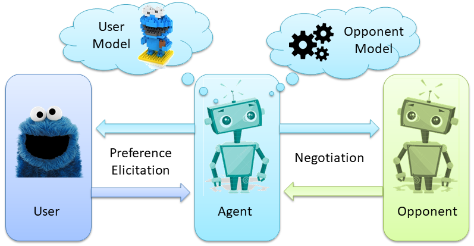

# 知己
上一章节，我们已经学习了如何预测对手模型。那么这一章节，我们将会学习如何预测自己的模型(User model)🐷。

因为大部分人在预测对手模型时，都采用了Johny Black的算法。这也就意味着，在预测对手模型时，大家的水平基本上都一样，那么，能拉开差距的就是预测User Model🥬。

## Elicitation

### Elicitation的概念
在Lab4的开始，讲到了一个概念，叫 preference elicitation (偏好启发)🧐。什么意思呢？我们可以通过Lab4中的一张图更好的理解其中的意思。


作为Agent的你，其实是不知道User具体的偏好是啥。我们需要通过问询User你喜欢啥，来判断User的偏好。当然了，User自己也不可能精确的告诉你他更喜欢哪个attribute,相应的evaluation是多少。对于User来说，他只能告诉你一个"an ordinal ranking of outcomes"。就是User给了你一堆offer,假设10个offer，他能告诉你我这10个offer的utility从小到大的顺序。那么具体User的Utility space是什么样的，你是不会知道的🤨。

### Elicitation cost
所以，每一次negotiation的一开始，你都会通过内置的API获得一堆offer的排序 (通过 `getBidRanking()`方法，索引为0是最低的bid。)。这个ranking的数目是有限的，根据不同的场景，可以获得不同数量的bids.

那么，如果我还想获得更多的bids的排序怎么办(有些人是有这些需求的，因为当bids越多，你对User model的预测将会越准)？你是可以通过`elicitRank`方法额外的查询一定数目的bids。但是会产生相应的cost,称之为elicitation cost,或者称之为bother cost。你问的越多，最后会在你的效用上扣除相应的"咨询费用"💰。

干货🥬：从我和上届学长的经验来说，你基本上不需要进行额外的征询。原因有几个方面。

首先，对于很多高级一点的算法，比方说你用机器学习算法，或者进化算法，因为计算量都比较大，很多时候，你给我的bids越多，那么我就算的越多。但系统基本上开局只给你一分钟时间算User model。我用的遗传算法，有个学长用的梯度下降算法，都面临的问题就是，在一些Domain比较大的场景下，可能给的bid的数目非常多，接近1500个(你们可以查一下agent negotiation的评价手册，里面有提到最高的bids数目的上限是多少)。面对这么多bids的ranking，我和那个学长最后的处理方式都是选择去掉很多bids。保证能在系统设置的时间范围内算完🤣。我删都来不及呢，何必还要自掏腰包，去"咨询"额外的信息呢。

其次，elicitation cost不容易控制。我们这届出现过因为在这个点处理失误，导致最后分数偏低的，因为咨询的数目不知道在什么情况下，咨询了太多次了。

再其次，我觉得像agent GG这种时间复杂度为O(1),都没有征询过一次，还表现的如此稳健。也侧面说明了，可能额外征询是个鸡肋🍗(当然，也有可能我没有考虑很多特殊的场景)。

总而言之，能不用`elicitRank`就不用好了。

### 安装9.1.12版本 Genius
Lab4中也提到了，要想使用elicitation的机制，必须需要更新一下jar包到9.1.12版本。别忘了。


## 遗传算法预测对手模型
Lab4后面的内容其实就是教你如何使用Preference elicitation, 建议你们过一遍，有个印象。但是2.3.2这一小节，老师提供了Linear programming的一个思路来帮助你去预测User Model。你们也可以试试这种预测自己模型的方式。🤖因为我没试过这种方法，其实我也不知道效果如何。不过我身边有个同学用了这种方法，感觉效果一般。建议可以让一个队友负责用这种方法实现，其他队友负责其他方法。分工明确。🦄

那么这一章节呢，我将会从我自己的agent的角度来给大家提供一个新的思路。

我的预测User model的算法是基于遗传算法🦍。或许很多童鞋对此很陌生。但是你们听过《物种起源》，听过进化论，听过达尔文。可能你难以想象AI能和进化论扯上关系(AI的一个分支是专门研究进化算法的，比如南安的AI有一门选课叫Evolution of Complexity，就是研究这些)。但是确实，当你按照我的思路把你的遗传算法agent写出来之后，你或许真的能领会到这个理论的奥秘。

ps📚:这里我埋下一个问题。这个问题需要你在学习AI的路程上慢慢体会。问题就是进化算法和梯度下降算法有什么共性，有什么不同？他们的目的相同吗？他们所需要的条件相同吗？如果有一天你发现在你学完很多optimizer之后(比如SGD,Adam),或者读到一些AutoML内容，或者有关超参空间搜索的内容，希望你能回过头来思考一下这个问题。


### 物竞天择 适者生存
开篇我就告诉你我们用遗传算法的目的是啥。我们的目的就是"适者生存"。

谁生存？Utilityspace生存。回顾之前我提到过的内容，每个人的都有自己的Preference,每个Preference在Genius中的一个实例就是Utilityspace(在实验中都是Additive Utilityspace)。那么我们是不是能通过"适者生存"的生存法则，选出一个最好的Utilityspace，这个Utilityspace所产生的评估bids的方法能够最大限度的接近bids ranking中bids顺序？

是不是听着有点抽象有点绕？没事，我举个例子好啦。

首先，我们需要选出一个最好的Utilityspace，这个Utilityspace中的每个issue的权重呀啥的都是确定的。这也就意味着，我们可以算出每个bids对自己的utility对不对？还记得这一章的开头，我们是不是每次negotiation都能获得一定数目的bids，以及他们对我的utility从小到大的排序？如果我选出的最好的Utilityspace，把这么多bids都计算一次utility，然后给他们按照我算的utility的顺序进行排序。这个我预测出来的排序如果和我刚开始从User那获得的排序如果相差不是很大，是不是我就可以理解为，我拟合出了一个好的模型呢？💁‍♂️

那我拿到这个Utilityspace有什么用呢？用处可大啦。我不仅可以知道对手每次提出的bids对我的utility是多少，我也可以每次出offer的时候，能够知道我出的offer给我自己带来的utility是多少。这就是预测User Model为什么如此重要。

那么接下来的内容就会介绍，如何去利用已有的API去实现"适者生存"！🐒


### 理清脉络
1. 首先，我们需要初始化一个种群(Population)🦍，这个种群里的物种的类型(Type),是```AbstractUtilitySpace```这个类型的```UtilitySpace```(你可以把这个物种想象成猩猩)。

2. 紧接着，这些```AbstractUtilitySpace```按照一定的规律交叉(Crossover)和变异(Mutation)。一代又一代。

3. 对于每一代呢，我们要固定这个Population的数量，所以坑位🛏有限，就会出现"物竞天择"的情况。那么我们需要通过什么方式去筛选好的```AbstractUtilitySpace```呢？这就引入了一个非常重要的概念，叫 Fitness Function(适应性函数)。

4. 顾名思义，这就是一个打分函数，去评判哪些个体能够适应当前的环境。分数越高，那么你这个```AbstractUtilitySpace```就获得了21世纪的交配权，把自己的一些权重，和更好的一个```AbstractUtilitySpace```的权重进行匹配，生成一个拥有一个新的权重的孩子。Fitness Function有点像 机器学习中的Loss Function(损失函数)，只不过，损失函数是分数越低，误差越低，模型越好。但是Fitness Function是打分函数，分数越高，模型越好。当然，Fitness函数的定义是你自己定的，所以，你们可以在此基础上创新，创造出一个比较🐂🍺的打分函数。

5. 在你知道当前Population下的每个```AbstractUtilitySpace```的Fitness Function时，你要筛选出优秀的个体。如何筛选？这里就涉及到一个算法，叫🎲"轮盘赌"算法，有点像赌场里的轮盘一样，一个个体的Fitness分数越高，它越容易被筛选出来。当然，这里我也配合了"精英选择"策略，就是这个群体里的前几名，直接晋级获得交配权♂♀。

6. 筛选的过程中，我们不仅要保留"精英"，也要出现变异的情况。确保一些潜力股不会被抛弃，因为他们的Fitness可能当前比较低，但是几代之后的孩子们👶的Fitness说不定就是个高富帅呢！所以我们要定义一个变异率，让一些个体随机的获奖获得交配权。"Mutation"这个概念可以说是进化算法的"重点"。因为这种随机性，可以帮助模型跳出局部最优解的情况，从而更好的接近全局最优解！！！

7. 最后，你就找到一个经过好几代的繁衍才诞生的超级```AbstractUtilitySpace```，它可以近似的替代User Model。你获得的每个bid或者你出的每个bid，都可以通过它获得Utility！👼

那么我们就要开始实现整个算法啦，🐛冲！

### 创新一个GeneticAlgorithm类
正如和Johny Black一样，我们同样用一个类来实现遗传算法。首先你需要新建这个类。类的一些成员变量就是一些超参数，如```popSize```，决定了你每个种群的大小是多少。你们最后可以通过调整这些超参数，来寻找最好的模型。🎬

```java
import genius.core.Bid;
import genius.core.issue.Issue;
import genius.core.issue.IssueDiscrete;
import genius.core.issue.Value;
import genius.core.issue.ValueDiscrete;
import genius.core.uncertainty.AdditiveUtilitySpaceFactory;
import genius.core.uncertainty.BidRanking;
import genius.core.uncertainty.UserModel;
import genius.core.utility.AbstractUtilitySpace;
import genius.core.utility.AdditiveUtilitySpace;
import genius.core.utility.EvaluatorDiscrete;

import java.util.*;

public class GeneticAlgorithm {
    private UserModel userModel;
    private Random random=new Random();

    private List<AbstractUtilitySpace> population=new ArrayList<AbstractUtilitySpace>();  //用于存放所有的累加效用空间population
    private int popSize=500;         //每一个population的总数
    private int maxIterNum=170;      //最大迭代的次数
    private double mutationRate=0.04;//变异几率

    //构造函数。实例该类的同时，必须得传入UserModel，这个东西可以帮助我们获得当前domain下我们需要的各种信息⚽️。
    public GeneticAlgorithm(UserModel userModel) {
        this.userModel = userModel;
    }

......还有很多类的方法
}
```

### 构建一个主体函数
主体函数这个名字是我自己起的。意思是，当你的Agent初始化时，你会 ```new``` 一个```GeneticAlgorithm```的对象，比如就叫```gen```吧。然后你只要```gen.geneticAlgorithm()```,它就会返回一个```AbstractUtilitySpace```,就是你所需要的那个模型。

在主体函数里面，主要写了整个计算的过程。这其中包括，物种迭代，轮盘选择，交叉变异，根据Fitness得分，获得最优解。最后返回这个模型。

```java
//函数主体，返回一个预测的效用空间。
    public AbstractUtilitySpace geneticAlgorithm(){
        //初始化种群
        for(int i=0; i<popSize*4;i++){
            population.add(getRandomChromosome());  //此时种群里有2000个。后面会择优筛掉1500个
        }

        //重复迭代maxiterNum次
        for(int num=0;num<maxIterNum;num++){
            List<Double> fitnessList=new ArrayList<>();

            for(int i=0;i<population.size();i++){
                fitnessList.add(getFitness(population.get(i)));
            }

            //轮盘选择这些population。
            population=select(population,fitnessList,popSize);

            //crossover,crossover的时候考虑变异
            for(int i=0;i<popSize*0.1;i++){
                AdditiveUtilitySpace father=(AdditiveUtilitySpace) population.get(random.nextInt(popSize));
                AdditiveUtilitySpace mother=(AdditiveUtilitySpace) population.get(random.nextInt(popSize));
                AbstractUtilitySpace child=crossover(father,mother);
                population.add(child);
            }

        }

        //对最后一个种群只挑选最好的，作为最后的答案。。防止遇到突然变异，导致误差瞬间上升
        List<Double> lastFitnessList=new ArrayList<>();
        for(AbstractUtilitySpace i:population){
            lastFitnessList.add(getFitness(i));
        }
        double bestFitness=Collections.max(lastFitnessList);
        int index=lastFitnessList.indexOf(bestFitness);
        System.out.print("结果是:");
        getFitness(population.get(index));

        return  population.get(index);
    }
```

上述的主体函数里面的细节，比如Fitness函数，是单独的写在类里的。主体函数只是负责调用。那么接下来，我就一个一个带大家过一遍这些函数的细节实现，希望你们能得到我的启发，做出更好的表现😊。

### Fitness函数
Fitness函数的质量决定了你得模型的效果。有时候，你就稍微改一下参数，就会发现，结果能有质的飞跃。这个函数的参数就是一个```AbstractUtilitySpace```

1. 首先，我们通过```userModel```获得了一个按照Utility从小到大排列的bid的列表。

2. 为了防止```userModel```一次给了过多的bid，比如1500，我们需要从中筛选一些。我才用了比较哦笨的方法，用数量范围去筛掉一部分bids。(之前提过，任何吃计算能力的算法，都有可能遇到这种情况，导致计算超时)

3. 现在我们假定一共有500个bids,我们把用传进来的```AbstractUtilitySpace```的```getUtility(bid)```方法去计算这500个bids的预测效用。

4. 因为这500个bids有了新的效用，我们可以按照从小到大的顺序去排序它。这样我们得到了一个新的排序。

5. 新的排序和旧的排序会有很明显的错位，比如索引为0的地方，原本应该是100，但现实的情况是100在索引为40的地方，那么误差为(0-40),这时候，可以选择平方这个误差$(0-40)^2=1600$,有就是最多会有500个位置都有误差，将这些误差累计起来，就成为了总的error

6. 利用这个总的error，你可以用一种转换，使之error越小，分数越高。。这里我尝试用$log$去解决这个问题。函数是$-15 \times \log \left(\frac{\text { error }}{\text { size }^{3}}+0.000001\right)$。当然，你也可以自己创造出一些,比如$e^x$,高斯函数啥的(虽然这些我都试过)。我建议有兴趣的同学可以去查一下Cross Entropy Error Function(交叉熵函数)。🐳我当时是因为没有学过深度学习，所以随便乱试试到了$log$这个方法，但是交叉熵函数本身也是利用了$log$。这个知识点，可以说比较超前噢，让你们知道，原来不仅仅有最小二乘法(平方误差损失函数)，还有交叉熵。

7. 你可以将每次迭代的error打印下来，去评判这个模型好不好，收敛的快不快，甚至绘图(最后report要是有几张炫酷的损失下降图片，会很加分噢🐯)

8. 最后别忘了返回score。因为你的Fitness函数是要被调用的哈。
```java
 private double getFitness(AbstractUtilitySpace abstractUtilitySpace){
        BidRanking bidRanking = userModel.getBidRanking();   //1.先从userModel中取出bidRanking列表

        //先把bidRanking存放在一个列表了。不然的话，待会不能靠索引去取值。
        List<Bid> bidRankingStore=new ArrayList<>();
        for(Bid bid:bidRanking){
            bidRankingStore.add(bid);
        }

        //2.我们要单独写一个bidList去存放bidRanking去防止计算量过大。
        List<Bid> bidList =new ArrayList<>();

        //如果bid量小于400
        if(bidRanking.getSize()<=400){
            for(Bid bid:bidRanking){
                bidList.add(bid);
            }
        }

        //如果bid量在400和800之间
        else if(bidRanking.getSize()>400&&bidRanking.getSize()<800){
            for(int i=0;i<bidRanking.getSize();i+=2){
                bidList.add(bidRankingStore.get(i));
            }
        }
        ...此处省略多行...


        List<Double> utilityList=new ArrayList<>();
        for(Bid bid:bidList){
            utilityList.add(abstractUtilitySpace.getUtility(bid));   //计算在当前空间下，每个bidRanking的实际效用是多少。并且放入utilityList中。
        }                                                             //注意，此时的utilityList的索引和bidRanking的索引是相同的。我们需要利用这个存放在TreeMap中


        TreeMap<Integer,Double> utilityRank=new TreeMap<>();   //构建treeMap，一个存放一下当前的索引，一个存放对应索引的utility。

        for(int i=0;i<utilityList.size();i++){   //这里对utility进行遍历，将索引和效用存放在TreeMap中。
            utilityRank.put(i,utilityList.get(i));
        }

        //4. 此时我们需要根据TreeMap的值进行排序（值中存放的是效用值）
        Comparator<Map.Entry<Integer,Double>> valueComparator = Comparator.comparingDouble(Map.Entry::getValue);
        // map转换成list进行排序
        List<Map.Entry<Integer,Double>> listRank = new ArrayList<>(utilityRank.entrySet());
        // 排序
        Collections.sort(listRank, valueComparator);

        //用以上的方法，TreeMap此时就被转换成了List。这tm什么方法我也很烦躁。。
        //list现在长这个样子。[100=0.3328030236029489, 144=0.33843867914476017, 82=0.35366230775310603, 68=0.39994535024458255, 25=0.4407324473062739, 119=0.45895568095691974,
        //不过这也有个好处。就是列表的索引值，可以表示为utilityList的索引值。

        int error=0;
        for(int i=0;i<listRank.size();i++){
            int gap=Math.abs(listRank.get(i).getKey()-i);  //5. 这里的i其实可以对应utilityList的索引i。假设i=1.此时在utilityList中的效用应该是最低值。
            error+=gap*gap;
        }                                             //但是，在listRank中，效用最低的值对应的index竟然是100。那说明，这个效用空间在第一个位置差了很大。
                                                        // 同理，如果listRank中的每一个键能正好接近或者等于它所在的索引数，那么说明这个效用空间分的就很对。

        //6. 对数思想，需要的迭代次数最少
        double score=0.0f;
        double x=error/(Math.pow(listRank.size(), 3));
        double theta=-15*Math.log(x+0.00001f);  //利用对数思想   -15
        score=theta;
        System.out.println("Error:"+error);  //7. 监控每次迭代的error的大小

        return score;  //8. 返回fitness score

    }
```

