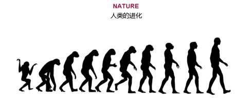

# 知己
上一章节，我们已经学习了如何预测对手模型。那么这一章节，我们将会学习如何预测自己的模型(User model)🐷。

因为大部分人在预测对手模型时，都采用了Johny Black的算法。这也就意味着，在预测对手模型时，大家的水平基本上都一样，那么，能拉开差距的就是预测User Model🥬。

## Elicitation

### Elicitation的概念
在Lab4的开始，讲到了一个概念，叫 preference elicitation (偏好启发)🧐。什么意思呢？我们可以通过Lab4中的一张图更好的理解其中的意思。

作为Agent的你，其实是不知道User具体的偏好是啥。我们需要通过问询User你喜欢啥，来判断User的偏好。当然了，User自己也不可能精确的告诉你他更喜欢哪个attribute,相应的evaluation是多少。对于User来说，他只能告诉你一个"an ordinal ranking of outcomes"。就是User给了你一堆offer,假设10个offer，他能告诉你我这10个offer的utility从小到大的顺序。那么具体User的Utility space是什么样的，你是不会知道的🤨。

### Elicitation cost
所以，每一次negotiation的一开始，你都会通过内置的API获得一堆offer的排序 (通过 `getBidRanking()`方法，索引为0是最低的bid。)。这个ranking的数目是有限的，根据不同的场景，可以获得不同数量的bids.

那么，如果我还想获得更多的bids的排序怎么办(有些人是有这些需求的，因为当bids越多，你对User model的预测将会越准)？你是可以通过`elicitRank`方法额外的查询一定数目的bids。但是会产生相应的cost,称之为elicitation cost,或者称之为bother cost。你问的越多，最后会在你的效用上扣除相应的"咨询费用"💰。

干货🥬：从我和上届学长的经验来说，你基本上不需要进行额外的征询。原因有几个方面。

首先，对于很多高级一点的算法，比方说你用机器学习算法，或者进化算法，因为计算量都比较大，很多时候，你给我的bids越多，那么我就算的越多。但系统基本上开局只给你一分钟时间算User model。我用的遗传算法，有个学长用的梯度下降算法，都面临的问题就是，在一些Domain比较大的场景下，可能给的bid的数目非常多，接近1500个(你们可以查一下agent negotiation的评价手册，里面有提到最高的bids数目的上限是多少)。面对这么多bids的ranking，我和那个学长最后的处理方式都是选择去掉很多bids。保证能在系统设置的时间范围内算完🤣。我删都来不及呢，何必还要自掏腰包，去"咨询"额外的信息呢。

其次，elicitation cost不容易控制。我们这届出现过因为在这个点处理失误，导致最后分数偏低的，因为咨询的数目不知道在什么情况下，咨询了太多次了。

再其次，我觉得像agent GG这种时间复杂度为O(1),都没有征询过一次，还表现的如此稳健。也侧面说明了，可能额外征询是个鸡肋🍗(当然，也有可能我没有考虑很多特殊的场景)。

总而言之，能不用`elicitRank`就不用好了。

### 安装9.1.12版本 Genius
Lab4中也提到了，要想使用elicitation的机制，必须需要更新一下jar包到9.1.12版本。别忘了。

## 遗传算法预测对手模型
Lab4后面的内容其实就是教你如何使用Preference elicitation, 建议你们过一遍，有个印象。但是2.3.2这一小节，老师提供了Linear programming的一个思路来帮助你去预测User Model。你们也可以试试这种预测自己模型的方式。🤖因为我没试过这种方法，其实我也不知道效果如何。不过我身边有个同学用了这种方法，感觉效果一般。建议可以让一个队友负责用这种方法实现，其他队友负责其他方法。分工明确。🦄

那么这一章节呢，我将会从我自己的agent的角度来给大家提供一个新的思路。

我的预测User model的算法是基于遗传算法🦍。或许很多童鞋对此很陌生。但是你们听过《物种起源》，听过进化论，听过达尔文。可能你难以想象AI能和进化论扯上关系(AI的一个分支是专门研究进化算法的，比如南安的AI有一门选课叫Evolution of Complexity，就是研究这些)。但是确实，当你按照我的思路把你的遗传算法agent写出来之后，你或许真的能领会到这个理论的奥秘。

ps📚:这里我埋下一个问题。这个问题需要你在学习AI的路程上慢慢体会。问题就是进化算法和梯度下降算法有什么共性，有什么不同？他们的目的相同吗？他们所需要的条件相同吗？如果有一天你发现在你学完很多optimizer之后(比如SGD,Adam),或者读到一些AutoML内容，或者有关超参空间搜索的内容，希望你能回过头来思考一下这个问题。

### 物竞天择 适者生存
开篇我就告诉你我们用遗传算法的目的是啥。我们的目的就是"适者生存"。

谁生存？Utilityspace生存。回顾之前我提到过的内容，每个人的都有自己的Preference,每个Preference在Genius中的一个实例就是Utilityspace(在实验中都是Additive Utilityspace)。那么我们是不是能通过"适者生存"的生存法则，选出一个最好的Utilityspace，这个Utilityspace所产生的评估bids的方法能够最大限度的接近bids ranking中bids顺序？

是不是听着有点抽象有点绕？没事，我举个例子好啦。

首先，我们需要选出一个最好的Utilityspace，这个Utilityspace中的每个issue的权重呀啥的都是确定的。这也就意味着，我们可以算出每个bids对自己的utility对不对？还记得这一章的开头，我们是不是每次negotiation都能获得一定数目的bids，以及他们对我的utility从小到大的排序？如果我选出的最好的Utilityspace，把这么多bids都计算一次utility，然后给他们按照我算的utility的顺序进行排序。这个我预测出来的排序如果和我刚开始从User那获得的排序如果相差不是很大，是不是我就可以理解为，我拟合出了一个好的模型呢？💁‍♂️

那我拿到这个Utilityspace有什么用呢？用处可大啦。我不仅可以知道对手每次提出的bids对我的utility是多少，我也可以每次出offer的时候，能够知道我出的offer给我自己带来的utility是多少。这就是预测User Model为什么如此重要。

那么接下来的内容就会介绍，如何去利用已有的API去实现"适者生存"！🐒

